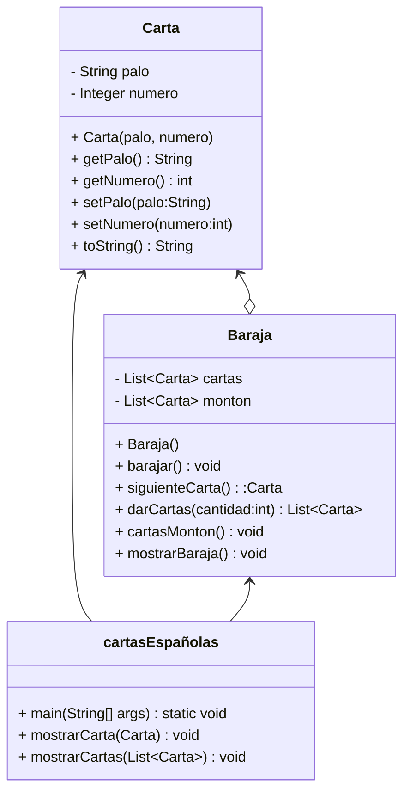

```mermaid
classDiagram
    class Carta{
        - String palo
        - Integer numero
        + Carta(palo, numero)
        + getPalo() String
        + getNumero() int
        + setPalo(palo:String)
        + setNumero(numero:int)
        + toString()String
    }

    class Baraja {
        - List~Carta~ cartas
        - List~Carta~ monton
        + Baraja()
        + barajar() void
        + siguienteCarta():Carta
        + darCartas(cantidad:int) List~Carta~
        + cartasMonton() void
        + mostrarBaraja() void

    }
    Carta <--o Baraja
    Carta <-- cartasEspañolas
    Baraja <-- cartasEspañolas


    class cartasEspañolas{
        + main(String[] args) static void

        + mostrarCarta(Carta) void
        + mostrarCartas(List~Carta~) void
    }
```
