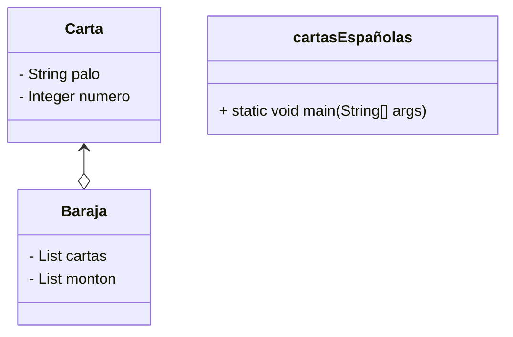

```mermaid
classDiagram
    class Carta{
        - String palo
        - Integer numero

    }

    class Baraja {
        - List<Carta> cartas
        - List<Carta> monton

    }
    Carta <--o Baraja


cartas Españolas: + static void main(String[] args)
```
