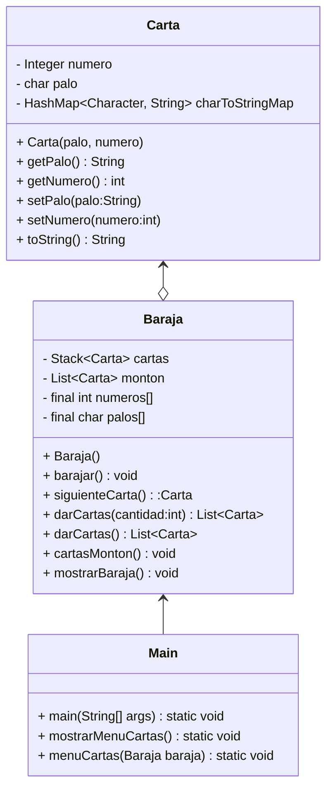

```mermaid
classDiagram
    class Carta{
        - Integer numero
        - char palo
        - HashMap~Character, String~ charToStringMap
        + Carta(palo, numero)
        + getPalo() String
        + getNumero() int
        + setPalo(palo:String)
        + setNumero(numero:int)
        + toString()String
    }

    class Baraja {
        - Stack~Carta~ cartas
        - List~Carta~ monton
        - final int numeros[]
        - final char palos[]
        + Baraja()
        + barajar() void
        + siguienteCarta():Carta
        + darCartas(cantidad:int) List~Carta~
        + darCartas() List~Carta~
        + cartasMonton() void
        + mostrarBaraja() void

    }
    Carta <--o Baraja
    Baraja <-- Main


    class Main{
        + main(String[] args) static void
        + mostrarMenuCartas() static void
        + menuCartas(Baraja baraja) static void
    }
```
