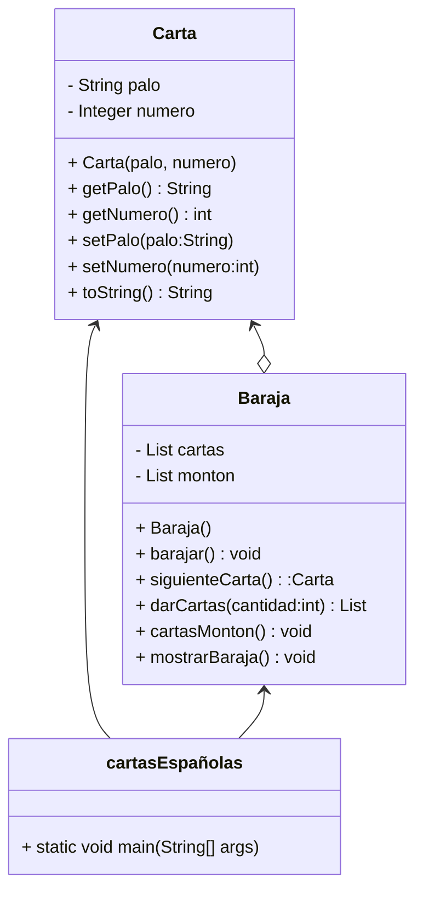

```mermaid
classDiagram
    class Carta{
        - String palo
        - Integer numero
        + Carta(palo, numero)
        + getPalo() String
        + getNumero() int
        + setPalo(palo:String)
        + setNumero(numero:int)
        + toString()String
    }

    class Baraja {
        - List<Carta> cartas
        - List<Carta> monton
        + Baraja()
        + barajar() void
        + siguienteCarta():Carta
        + darCartas(cantidad:int) List<Carta>
        + cartasMonton() void
        + mostrarBaraja() void

    }
    Carta <--o Baraja
    Carta <-- cartasEspañolas
    Baraja <-- cartasEspañolas


cartas Españolas: + static void main(String[] args)
```
